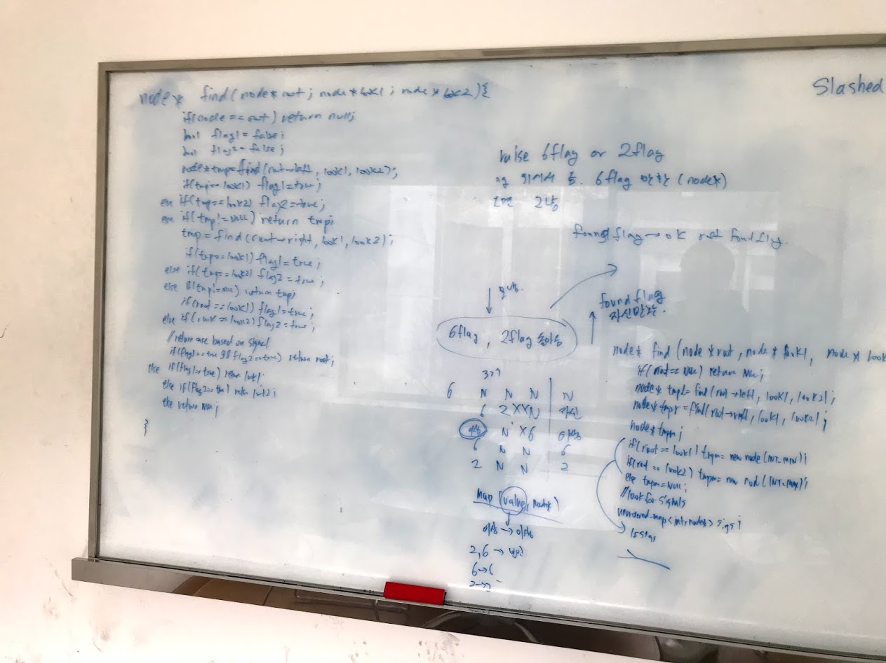
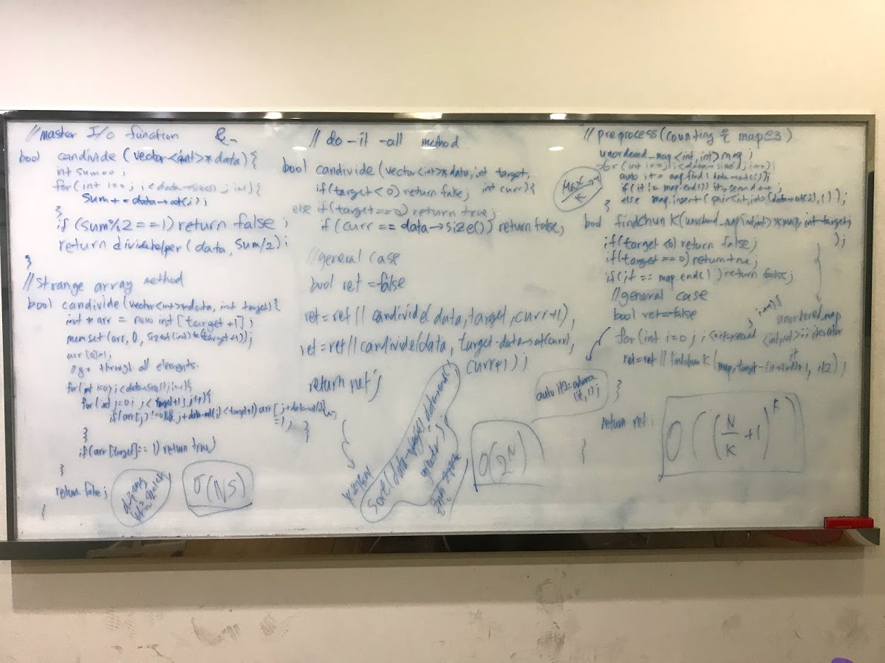

# Algorithm practice and implementations

## How to run

these code may not run. try :

* for c/cpp programs

  ` g++ -o {{executable name}} {{code file name}}`
  
* for java programs(on windows. for linux, no need for encoding/classpath flags)

` javac {{java file name}} -encoding UTF8`

`java -classpath . {{Main class name}}`

* for node.js algorithms

`node {{filename}}`

You may need to modify fs.readFileSync directory if in other than Linux. You can use a text input.

## Practice sources

1. [Baekjoon Online Judge](https://www.acmicpc.net/)
2. [Dovelet.com](http://59.23.150.58/)
3. [SW Expert Academy](https://swexpertacademy.com/main/main.do)
4. [Leetcode](https://leetcode.com/)
5. [GeekforGeeks](https://www.geeksforgeeks.org)
6. [Careercup](https://www.careercup.com/)

## Postscript : 

**I do hand coding;** *Many more problems solved on whiteboards, many more solved on paper. Hand coding gives you fundamental strength on programming*

